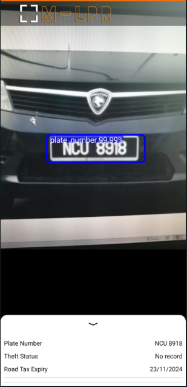

# Automatic-Malaysian-Vehicle-Plate-Number-Identification-Using-CNN

### https://ir.uitm.edu.my/id/eprint/50663/

### Automatic Malaysian plate number identification is an Android application system used in a dash camera to detect and recognize a license plate number. The objective of this project is to identify an issue in the plate number's record such as road tax expiry and missing car status. If the system found an issue, it will use text-to-speech function to speak out the character in the license plate. This project used image processing and Convolutional Neural Network (CNN) to recognize and detect every plate number on the road.

## You can test the system by using the image in "Testing image for Detection and Recognition.pdf"
### Email: test@gmail.com
### Password: 123456
### APK link: https://drive.google.com/file/d/1xVEWxUgDiXwN8oSMFnRBUyxhhSn1ypo8/view?usp=sharing

### Reference:
#### Object Detection: https://blog.roboflow.com/how-to-train-a-custom-mobile-object-detection-model/
#### OCR: https://www.youtube.com/watch?v=fmTlgwgKJmE&t
